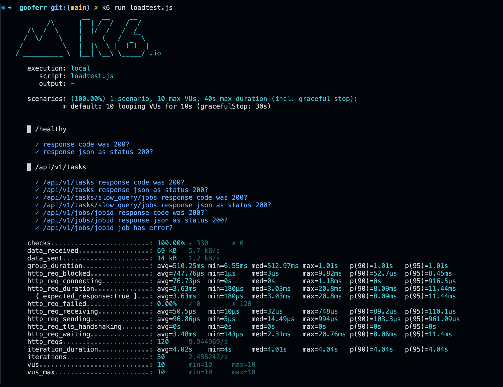

# Simple Documentation

This is a simple documentation for the provided code.

**Overview**

The provided code is a K6 script designed to test the performance of a web application. It simulates a load test scenario where multiple virtual users (VUs) interact with the application over a specified duration.

**Key Features**

1. **VUs and Duration**: The script is configured to run with 10 virtual users (VUs) for a duration of 10 seconds.
2. **API Endpoints**: The script tests two API endpoints: `/healthy` and `/api/v1/tasks`. It also tests a job creation scenario under `/api/v1/tasks`.
3. **Response Validation**: The script validates the response codes and JSON content for each API call to ensure the expected behavior.
4. **Sleep**: The script includes sleep intervals to simulate user think time and reduce the load on the application.

**Usage**

To use this script, save it as a JavaScript file (e.g., `loadtest.js`) and run it using K6. You can 
adjust the script to fit your specific testing needs by modifying the API endpoints, validation criteria, and sleep intervals.

### Reference and Attributions - 

* dungbeetle - https://github.com/zerodha/dungbeetle

